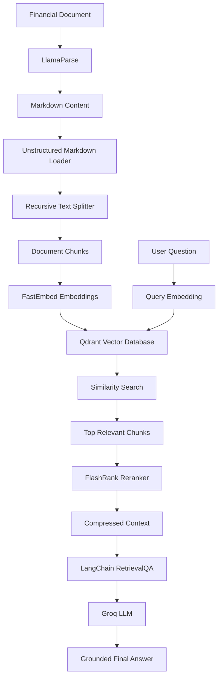

<p align="center">
  
</p>

<div align="center">

# RAG with LangChain

### Advanced Document Intelligence and Question-Answering Platform


<br>


</div>

---

## Overview

**RAG with LangChain** is an advanced Retrieval-Augmented Generation system designed to extract knowledge from documents and generate grounded answers using relevant retrieved context.

The project demonstrates a complete RAG pipeline using **LangChain**, **LlamaParse**, **FastEmbed**, **Qdrant**, **FlashRank**, and **Groq**. It processes financial documents, converts them into searchable vector representations, retrieves relevant information, reranks results, and generates context-aware responses.

The demonstration uses **Meta’s Q1 2024 Earnings Report** as the primary document for financial question answering.

---

## Core Capabilities

| Capability | Description |
|---|---|
| Document Parsing | Extracts structured content from financial documents using LlamaParse |
| Text Chunking | Divides documents into manageable semantic chunks |
| Vector Embeddings | Creates embeddings using FastEmbed |
| Vector Storage | Stores and searches document vectors with Qdrant |
| Semantic Search | Retrieves document sections based on meaning |
| Contextual Compression | Filters and reranks retrieved content using FlashRank |
| Grounded Question Answering | Generates answers from retrieved document context |
| Financial Document Analysis | Extracts insights from financial reports |
| Interactive Experiments | Includes Python scripts and Jupyter notebooks |

---

## System Architecture

```text
                         User Question
                               │
                               ▼
                     LangChain RAG Pipeline
                               │
                               ▼
                         Query Embedding
                               │
                               ▼
                     Qdrant Vector Search
                               │
                               ▼
                  Top Relevant Document Chunks
                               │
                               ▼
                    FlashRank Reranking Layer
                               │
                               ▼
                    Contextual Compression
                               │
                               ▼
                      Groq Language Model
                               │
                               ▼
                  Grounded Answer with Context
```

---

## RAG Workflow



---

## Document Processing Pipeline

### 1. Document Parsing

The financial report is downloaded and processed using **LlamaParse**. The extracted document content is saved in Markdown format for further processing.

### 2. Document Loading

The parsed Markdown document is loaded using:

```python
UnstructuredMarkdownLoader
```

### 3. Text Chunking

The document is divided into smaller chunks using:

```python
RecursiveCharacterTextSplitter
```

The project uses chunks of approximately `2048` characters to maintain useful context while improving retrieval performance.

### 4. Embedding Generation

Document chunks are transformed into vector embeddings using:

```text
BAAI/bge-base-en-v1.5
```

through the **FastEmbed** integration.

### 5. Vector Storage

The generated vectors are stored in **Qdrant**, enabling efficient semantic similarity search.

### 6. Retrieval and Reranking

The retriever selects the most relevant document chunks using similarity search. **FlashRank** then reranks and compresses the retrieved results to reduce irrelevant context.

### 7. Answer Generation

The final context is passed to a Groq-powered language model through LangChain’s RetrievalQA workflow to produce a grounded response.

---

## Technology Stack

| Layer | Technologies |
|---|---|
| Programming Language | Python |
| RAG Framework | LangChain |
| Language Model | Groq |
| Document Parser | LlamaParse |
| Document Loader | UnstructuredMarkdownLoader |
| Text Splitter | RecursiveCharacterTextSplitter |
| Embedding Framework | FastEmbed |
| Embedding Model | BAAI/bge-base-en-v1.5 |
| Vector Database | Qdrant |
| Reranking | FlashRank |
| Retrieval Chain | LangChain RetrievalQA |
| Interface and Experiments | Streamlit and Jupyter Notebook |

---

## Project Structure

```text
RAGwithLangChain_final/
│
├── RAGwithLangChain/
│   ├── app.py
│   ├── demo.ipynb
│   ├── demo1.py
│   ├── LangChain_AI_Agents.ipynb
│   ├── real.py
│   ├── README.md
│   │
│   ├── data/
│   │   └── Parsed and processed document files
│   │
│   └── .ipynb_checkpoints/
│
└── Screenshot 2026-03-13 005421.png
```

---

## Installation

### 1. Clone the repository

```bash
git clone https://github.com/your-username/RAGwithLangChain.git
```

### 2. Open the project directory

```bash
cd RAGwithLangChain/RAGwithLangChain
```

### 3. Create a virtual environment

```bash
python -m venv venv
```

### 4. Activate the virtual environment

#### Windows

```bash
venv\Scripts\activate
```

#### macOS or Linux

```bash
source venv/bin/activate
```

### 5. Install the required dependencies

```bash
pip install langchain langchain-community langchain-groq qdrant-client llama-parse fastembed flashrank unstructured[md] streamlit python-dotenv gdown
```

---

## Environment Configuration

Create a `.env` file inside the project directory:

```env
GROQ_API_KEY=your_groq_api_key
LLAMA_CLOUD_API_KEY=your_llama_cloud_api_key
```

Never upload API keys to GitHub.

Add the following entries to `.gitignore`:

```gitignore
.env
venv/
__pycache__/
.ipynb_checkpoints/
*.pyc
```

---

## Running the Project

### Run the Streamlit application

```bash
streamlit run app.py
```

### Run the advanced Python implementation

```bash
python real.py
```

### Open the Jupyter Notebook

```bash
jupyter notebook LangChain_AI_Agents.ipynb
```

---

## Example Questions

The system can answer questions such as:

```text
What was Meta's total revenue in Q1 2024?
```

```text
How did Meta's operating income change?
```

```text
What were the major business highlights in the report?
```

```text
What risks or challenges were mentioned?
```

```text
Summarize Meta's financial performance for Q1 2024.
```

---

## Retrieval Configuration

The system retrieves the most relevant document chunks using a configurable value of `k`.

Example:

```python
retriever = vector_store.as_retriever(
    search_kwargs={"k": 5}
)
```

A higher value retrieves more context but may introduce irrelevant information. FlashRank reranking helps select the strongest results before the final answer is generated.

---

## Example Pipeline

```python
from langchain.text_splitter import RecursiveCharacterTextSplitter
from langchain_community.embeddings.fastembed import FastEmbedEmbeddings
from langchain_community.vectorstores import Qdrant

text_splitter = RecursiveCharacterTextSplitter(
    chunk_size=2048,
    chunk_overlap=200
)

documents = text_splitter.split_documents(loaded_documents)

embeddings = FastEmbedEmbeddings(
    model_name="BAAI/bge-base-en-v1.5"
)

vector_store = Qdrant.from_documents(
    documents=documents,
    embedding=embeddings,
    location=":memory:",
    collection_name="financial_documents"
)
```

---

## Key Benefits

- Answers are based on retrieved document evidence
- Reduces unsupported model responses
- Supports semantic document search
- Improves retrieval quality through reranking
- Suitable for financial reports and enterprise documents
- Modular components can be independently replaced or upgraded
- Provides practical experience with modern RAG architecture

---

## Security Recommendations

- Store API keys only in environment variables
- Never hardcode credentials in Python files
- Validate uploaded document types and sizes
- Add authentication before production deployment
- Avoid exposing internal Qdrant collections publicly
- Log questions without storing sensitive document content
- Apply rate limiting to public deployments

> **Security notice:** Review all source files before publishing the repository and remove any hardcoded API keys or private credentials.

---

## Roadmap

- Multi-document question answering
- PDF upload through the web interface
- Answer source citations
- Persistent Qdrant storage
- Hybrid keyword and semantic retrieval
- Conversation memory
- OCR support for scanned documents
- LangGraph-based RAG agents
- Document comparison
- Evaluation using RAGAS
- Docker containerization
- REST API with FastAPI
- Cloud deployment

---

## Use Cases

- Financial report analysis
- Enterprise document question answering
- Research paper exploration
- Policy and compliance assistants
- Legal document retrieval
- Internal company knowledge systems
- Educational document assistants

---

## Developer

### Snehal Laxman Jadhav

**AI Engineer | Generative AI | LangChain | RAG | Vector Databases | Python**

---

<div align="center">

## Intelligent Answers Grounded in Your Documents

Built with:

**Python • LangChain • Qdrant • LlamaParse • FastEmbed • FlashRank • Groq**

<br>


<br>

⭐ Star the repository if you find this project useful.

</div>

<p align="center">
  
</p>

